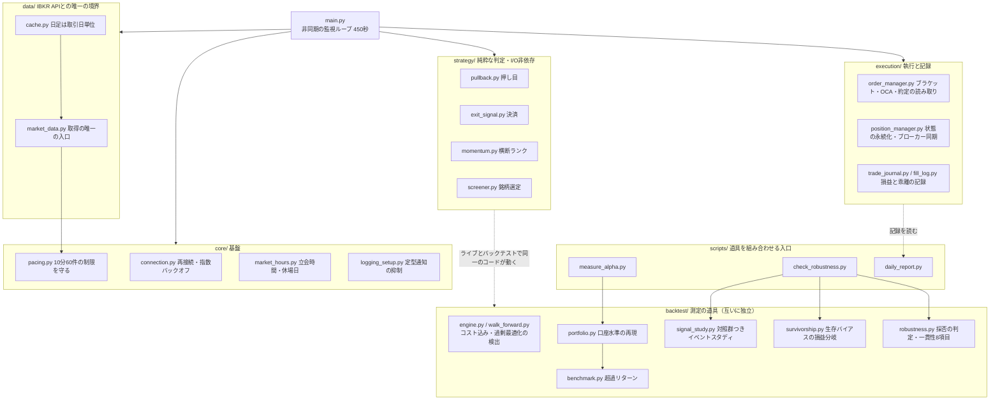
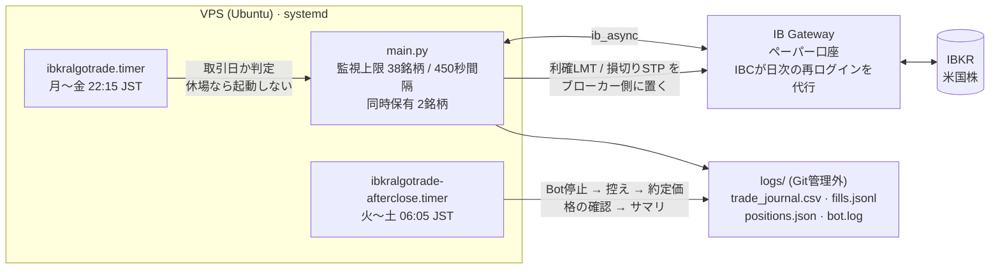

# 米国株 自動売買システム（Interactive Brokers API）

[](https://github.com/atsushi196323/ibkralgoTrade/actions/workflows/ci.yml)

Interactive Brokers の API を用い、米国株の押し目買い（日足の移動平均からの下方乖離）を検知して発注し、利確・損切りをブローカー側の待機注文（ブラケット注文）として置く自動売買システム。VPS 上で systemd により無人稼働する。

**現在はペーパー口座で注文層を検証している段階であり、実資金は投入していない。**

## このプロジェクトの結論

**このシステムは、稼げないという結論に到達している。それを自分で証明したことが成果物である。**

当初はプロフィットファクター 1.18 という数字を根拠に「エッジがある」と判断していた。しかしその指標は**ゼロを基準**にしており、「現金を持っているより良いか」しか答えていなかった。判断に必要なのは「**市場を持っているより良いか**」である。

同じトレードから「同じ日付区間で S&P500 (SPY) を持っていた場合」を差し引くと、こうなった。

| | 1トレードあたり |
| --- | --- |
| 戦略の純損益 | +0.492% |
| 同期間の SPY | +0.445% |
| **超過リターン（アルファ）** | **+0.047%（t = 0.09）** |

**+0.49% のうち 96% は、保有期間中に市場が上げたぶんだった。** 残りはゼロと区別がつかない。

その後、日足価格から作れる候補シグナルを 9 本、対照群つき・生存バイアスの感度つきで測ったが、採用基準（一貫性 8 項目）を通過したものは無い。最も強い横断モメンタムでも 7/8 で、生存バイアス耐性が不合格だった。

**この結論に至る過程で作った測定基盤が、このリポジトリの中身である。**

## 30秒で確かめる

サンプルの日足（10年・6銘柄）を同梱してあるので、IBKR の口座もAPIキーも不要で動く。

動作環境は **Python 3.11**（`pyproject.toml` の ruff / mypy もこの版に合わせてある）。

```bash
pip install -r requirements-dev.txt

# 番人テスト 953件（IBKRへの実接続なし・全てモック）
python -m pytest -q

# 単一銘柄のバックテスト（コスト込み・1秒未満）
python -m backtest.run --csv examples/bars/AAPL.csv --mode backtest --initial-equity 1220

# 銘柄横断のウォークフォワード（過剰最適化の検出。約3分）
python -m backtest.run --csv-dir examples/bars --initial-equity 1220
```

**「市場を持っていた場合」と比べる**——採否はこれで判断する。

同梱サンプルは6銘柄なので、上表（42銘柄で +0.047%）とは数字が違う（この6銘柄では **-1.026%** とさらに悪い）。**再現できるのは結論の数値ではなく測り方である。**

```bash
python -m scripts.measure_alpha --csv-dir examples/bars \
    --benchmark examples/index/SPY.csv --initial-equity 1220 --watchlist-size 0
```

**同じ結果が出ることを確かめる**——`--report` は、結果に**入力の指紋・パラメータ・実行環境**を添えて書き出す。

```bash
python -m backtest.run --csv examples/bars/AAPL.csv --mode backtest \
    --initial-equity 1220 --report report.md
```

先頭に出る `result_digest` は `SHA-256(入力の指紋 + パラメータ + 結果)` で、**同じデータ・同じ設定の実行なら一致する**。数字が前と違ったときに、**データが変わったのか・パラメータが変わったのか・コードが変わったのか**を切り分けられる。

**実行時刻と実行環境は digest に含めない。** 前者を入れると同じ入力の2回が必ず別の値になり、確認そのものが成立しない。後者は意図的で、確かめたいのは「**環境が変わっても数字が変わらないこと**」だからである（CIは pandas 2系と3系の両方で digest の一致を検証している）。

## 規模

| | |
| --- | --- |
| 本体のコード | 14,677行 |
| テストコード | 14,732行 / **953件** — IBKRへの実接続なし（全てモック）・約2秒で完走 |
| カバレッジ | 87%（`main.py` 91% / `execution/order_manager.py` 96%） |
| 型注釈 | 戻り値 416関数中 413（99%）・mypy 通過 |
| 構成 | 6パッケージ（接続 / データ取得 / 戦略判定 / 執行 / バックテスト / 運用スクリプト） |
| 稼働 | VPS（Ubuntu）+ systemd による無人運用。平日22:15起動・翌06:05締め（日本時間） |
| CI | GitHub Actions で lint（ruff）・型検査（mypy）・テストを、稼働環境と同じ Linux・pandas 2系/3系で実行 |

## 構成

### モジュールの依存関係



**読み方の要点が3つある。**

- **`data/` が IBKR API との唯一の境界である。** ペーシング制限（10分60件）とキャッシュを迂回させないため、他パッケージから IBKR のデータ取得APIを直接呼ぶことを禁じている。破ると例外ではなく**空のバー列**が返り、「データが無い銘柄」と区別がつかなくなる
- **`strategy/` は I/O に依存しない純粋関数で、ライブとバックテストが同じコードを動かす。** 点線がその共有を示している。ここが分岐すると、検証した戦略と稼働する戦略が別物になる
- **`backtest/` の各モジュールは pipeline ではなく、独立した測定の道具である。** 互いを import しておらず、組み合わせているのは `scripts/` 側である（`robustness.py` は `backtest/` から何も import しない）。新しい仮説が現れたとき、測る道具だけが再利用される

### 1日のサイクル



**2本のタイマーの曜日が1日ずれているのは誤りではない。** 金曜22:15に始まったセッションを閉じるのは土曜06:05のジョブなので、締め側を月〜金にすると**金曜のセッションが週末まで走り続ける**。

**祝日はスケジューラでは表現できない**（systemd の `OnCalendar` に除外の仕組みが無い）ため、判定は起動直前に行う。このとき**休場日（終了コード1）と判定失敗を区別すること**が要る——まとめて「起動しない」に倒すと、設定を間違えた日が休場日と同じ見た目になり、しかもスケジューラには成功として記録される。

### ここから読む

| 見たいもの | ファイル |
| --- | --- |
| **設計判断と検証結果のすべて** | [`docs/DECISIONS.md`](docs/DECISIONS.md) |
| 静かに壊れる注文層をどう固めたか | [`execution/order_manager.py`](execution/order_manager.py) |
| 採否の判定（一貫性8項目） | [`backtest/robustness.py`](backtest/robustness.py) |
| 生存バイアスを「消せないので上限で縛る」 | [`backtest/survivorship.py`](backtest/survivorship.py) |
| 「なぜ1件も建たなかったか」を1画面で | [`scripts/daily_report.py`](scripts/daily_report.py) |

## このシステムが難しい理由

- **主要な故障が例外を出さない。** データ購読の権限が無いとスクリーニングは空を返し、APIのレート制限違反は例外ではなく空のバー列として返り、注文の拒否は警告としてしか通知されない。いずれも異常終了しないため、「静かに縮退したまま動き続ける状態」をどう検知するかが設計の中心になる。
- **ドライランでは検証できない層がある。** 呼値の丸め、ブラケット注文の送信順序、OCA（一方が約定したら他方を取り消す）の連動、親子注文の関係の成立可否は、実際に発注しない限り1件も観測できない。実際に、取消要求の 1ミリ秒後に成行を出して 0.2秒で拒否される競合や、OCAグループ名がブローカー側で書き換わるために修正が拒否される挙動を、ペーパー発注で実測して不変条件に落としている。
- **バックテストは簡単に嘘をつく。** 過剰最適化・ルックアヘッド・生存バイアス・手数料の過小評価。銘柄横断・コスト込み・ウォークフォワードで検証し、エッジが無いと判定した仮説は、その根拠とともに無効化して記録している。

## 稼働時の出力

引け後に1取引日のサマリを出す（`python -m scripts.daily_report`）。**損益ではなく「なぜ建たなかったか」を読むための道具である。**

```
===== 2026-08-26 (米国東部時間) の稼働サマリ =====
口座資金: 1183.59 USD

--- 注文層の検証 ---
  残る未観測は利確LMTの約定1点。期限 2026-09-30 まで あと35日。
  逆指値側のOCA取消連動は2026-08-18 / 08-24に実測済み。

--- 新規建て ---
0件。以下は「なぜ建たなかったか」の材料。
  乖離率の判定まで進んだ銘柄が無い（監視サイクルは回っている）。
  見送り: 同時保有数の上限 (77回)
```

## 免責

- 本リポジトリは技術ポートフォリオであり、投資助言ではない。
- 本コードの利用によって生じたいかなる損失についても、作者は一切の責任を負わない。
